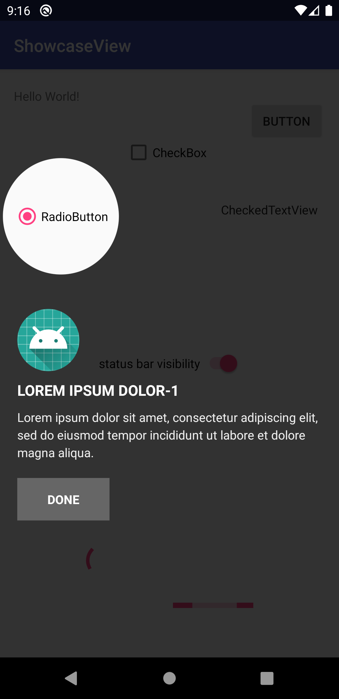
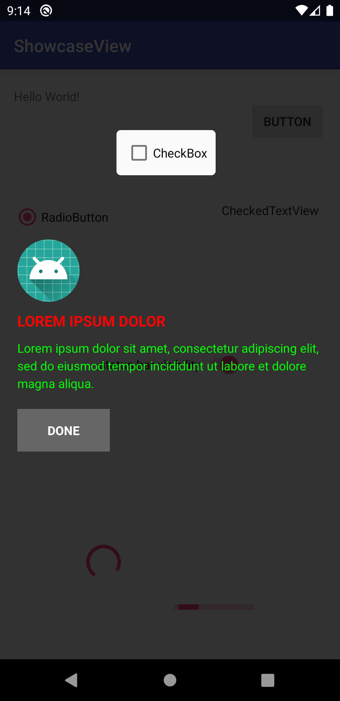
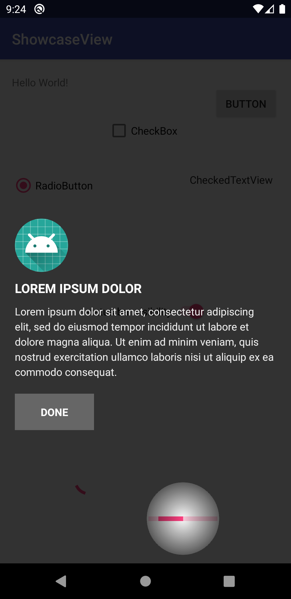
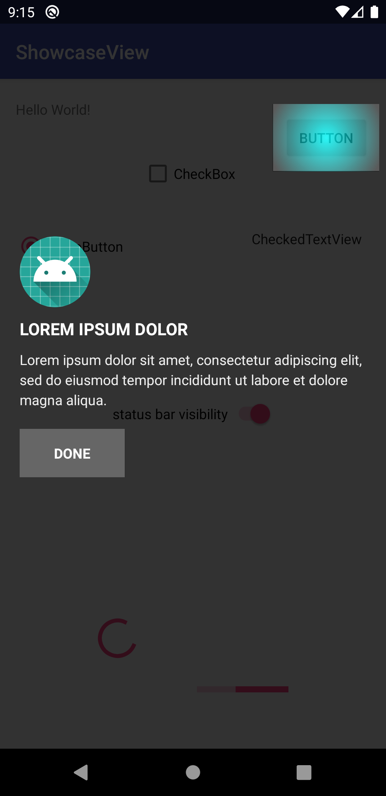
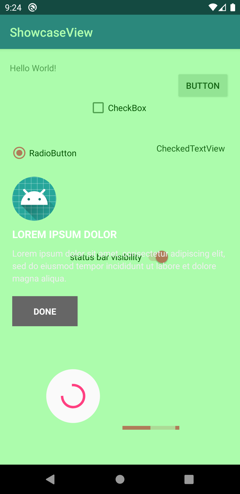

# Android ShowcaseView
[](https://jitpack.io/#erkutaras/ShowcaseView)
[](https://android-arsenal.com/details/1/7438)
[](https://opensource.org/licenses/Apache-2.0)

                    

ShowcaseView is a simple-use library for Android to display new feature or whatever to the users.

It is very popular issue how to display changes in the applications for owner of the application. Because of this reason, this issue came to necessity to develop how to show changes in the application, and this library is borned and developed.

There are many libraries for showcases, but it is problem to manage history for many of them. For example, your application has BottomNavigationView with three different item. You display new feature on third view with a library. Your flow is: first, application is opened; second, 3rd item is clicked; and then showcase is displayed. After this scenerio, your user can change view via bottom or back button. If the user didn't close showcase before changing the flow, you have to dismiss the showcase before change the UI. If not, the showcase is displayed different and wrong screen.

Because of similar reasons like above, ShowcaseView library is developed. The main advantage of ShowcaseView library is that you don't need to manage or follow view visibility in your codes. Because, when you call the ShowcaseManager to display showcase, ShowcaseManager will start new Activity and in this way, you have not to write extra code to dismiss showcase.

## Gradle

**Step 1.** Add the JitPack repository to your root build.gradle at the end of repositories:
```
allprojects {
    repositories {
        ...
        maven { url 'https://jitpack.io' }
    }
}
```

**Step 2.** Add the library dependency to your project build.gradle:
```
dependencies {
    implementation 'com.github.erkutaras:ShowcaseView:1.5.0'
}
```


## Usage

Sample code:
```
ShowcaseManager.Builder builder = new ShowcaseManager.Builder();
        builder.context(ShowcaseSampleActivity.this)
                .key("KEY")
                .developerMode(true)
                .view(view)
                .descriptionImageRes(R.mipmap.ic_launcher)
                .descriptionTitle("LOREM IPSUM")
                .descriptionText("Lorem ipsum dolor sit amet, consectetur adipiscing elit, sed do eiusmod tempor incididunt ut labore et dolore magna aliqua.")
                .buttonText("Done")
                .buttonVisibility(true)
                .cancelButtonVisibility(true)
                .cancelButtonColor(Color.White)
                .add()
                .build()
                .show();
```

To display showcaseview, `ShowcaseManager.Builder` is mandatory.

### Mandatory
| Usage         | Description | 
| ------------- |-------------| 
| `builder.context(Context)`        | to start new activity             |
| `builder.key(String)` | to decide this showcase is displayed or not|
| `builder.view(View)` |  showcase will be displayed for this view| 
| `builder.descriptionTitle(String)` |  view title| 
| `builder.descriptionText(String)` |  short description of view's purpose| 
| `builder.add()` |  adding the new showcase and can be called more than one to display multiple showcaseview| 
| `builder.build()` |  prepare the focus area(s)| 
| `builder.show()` |  display showcaseview| 

### Optinal
| Usage                                | Description                                                                           | 
| ------------------------------------ |-------------------------------------------------------------------------------------- | 
| `builder.developerMode(boolean)`     |  when you test your code, showcaseview will be displayed always if this field is true | 
| `builder.descriptionImageRes(int)`   |  display and set image which is located above of title                                | 
| `builder.buttonText(String)`         |  display and set text of button                                                       | 
| `builder.buttonVisibility(boolean)`  |  set visibility of button (default true)                                              | 
| `builder.cancelButtonVisibility(boolean)`  |  set visibility of cancel button (default true)                                 | 
| `builder.cancelButtonColor(int)`     |  set color of cancel button                                                           | 
| `builder.moveButtonsVisibility(boolean)`     |  set visibility of next and previous buttons (default false)                  |
| `builder.selectedMoveButtonColor(int)`     |  set color of next and previous buttons when the buttons are selected           |
| `builder.unSelectedMoveButtonColor(int)`     |  set color of next and previous buttons when the buttons are unselected       |
| `builder.alphaBackground(int)`       |  set alpha of background color                                                        | 
| `builder.colorBackground(int)`       |  set color of background                                                              | 
| `builder.colorFocusArea(int)`        |  set color of focus area                                                              | 
| `builder.colorDescText(int)`         |  set color of description text                                                        | 
| `builder.colorButtonText(int)`       |  set color of button text                                                             | 
| `builder.colorButtonBackground(int)` |  set color of button background                                                       | 
| `builder.marginFocusArea(intInDp)`   |  set margin of focus area                                                             | 
| `builder.circle()`                   |  set circle focus area                                                                | 
| `builder.rectangle()`                |  set rectangle focus area                                                             | 
| `builder.roundedRectangle()`         |  set rounded-rectangle focus area                                                     | 
| `builder.gradientFocusEnabled()`     |  set gradient enabled for focus area                                                  | 

### Listen to Showcase dismisses
If you want to listen showcase dismisses, you can override in your Activity/Fragment like below with `ShowcaseManager.REQUEST_CODE_SHOWCASE`:
```java
    @Override
    protected void onActivityResult(int requestCode, int resultCode, @Nullable Intent data) {
        if (requestCode == ShowcaseManager.REQUEST_CODE_SHOWCASE && resultCode == Activity.RESULT_OK) {
            // your code
        }
    }
```

## Issues

If you've found an error in this library, please file an [issue][1].

## Contributing

Patches and new features are encouraged, and may be submitted by [forking this project][2] and submitting a pull request through GitHub. 

[1]: https://github.com/erkutaras/ShowcaseView/issues
[2]: https://github.com/erkutaras/ShowcaseView/fork

# License

    Copyright 2018-2020 erkutaras

    Licensed under the Apache License, Version 2.0 (the "License");
    you may not use this file except in compliance with the License.
    You may obtain a copy of the License at

       http://www.apache.org/licenses/LICENSE-2.0

    Unless required by applicable law or agreed to in writing, software
    distributed under the License is distributed on an "AS IS" BASIS,
    WITHOUT WARRANTIES OR CONDITIONS OF ANY KIND, either express or implied.
    See the License for the specific language governing permissions and
    limitations under the License.
